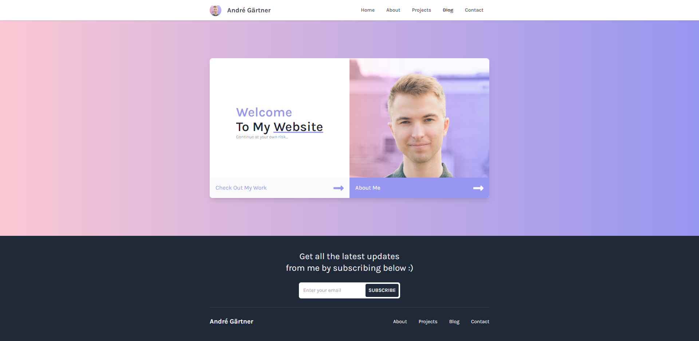
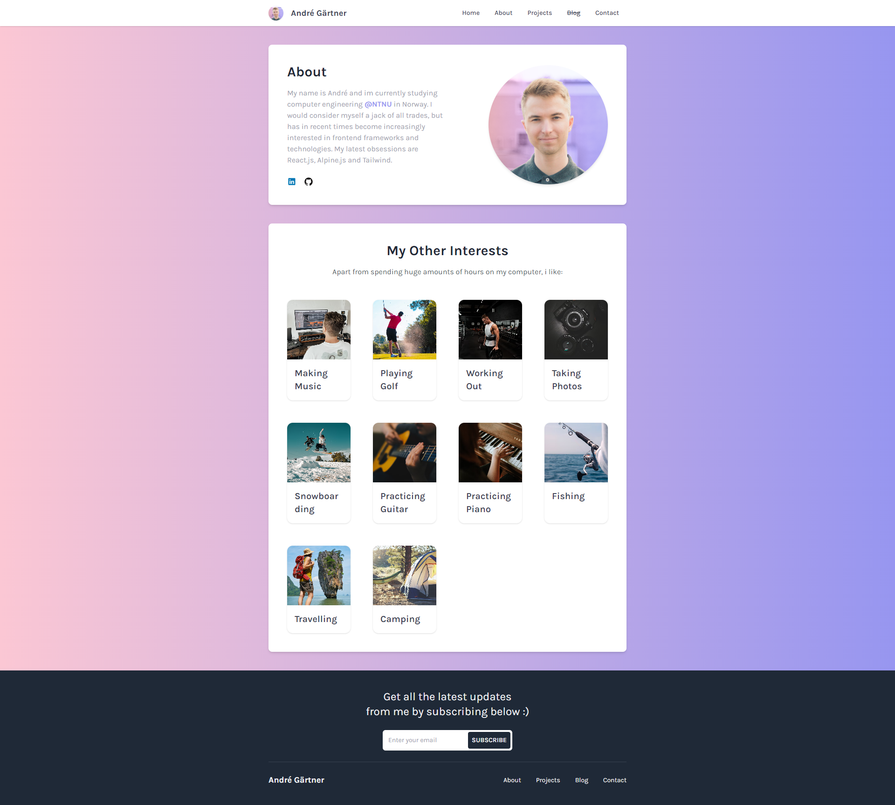
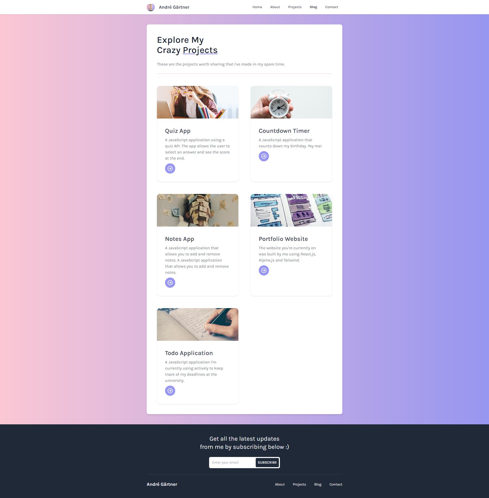
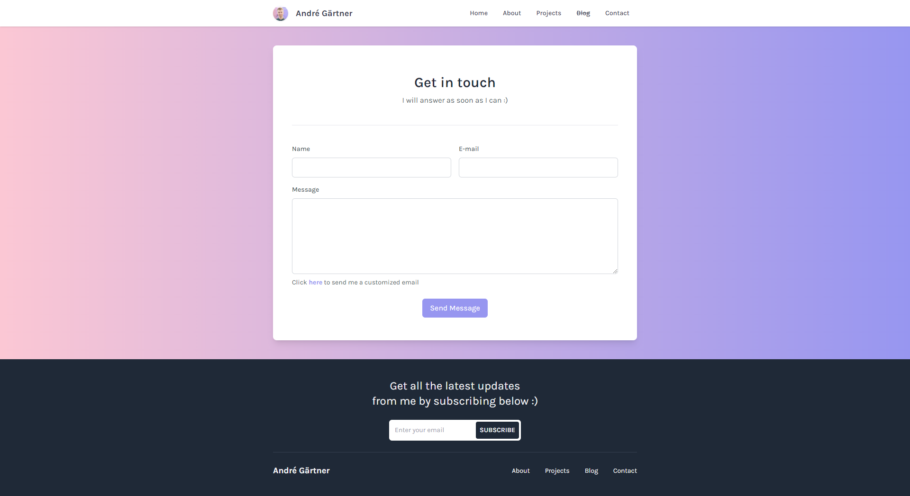

# React Portfolio
A personal portfolio website built using React.js, Tailwind CSS and Alpine.js.

## About
In summary, React.js was used to create the website's components, Tailwind CSS was used for styling, and Alpine.js was used to add some dynamic behavior to the website. These three technologies work together to create a responsive, visually appealing, and interactive portfolio website.

